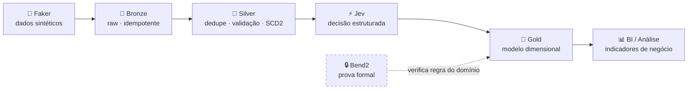

# Hail to the King 👑

**Projeto de pipeline Lakehouse ponta a ponta para recuperação de crédito, com decisão estruturada por IA e verificação formal de regra de negócio.**

> **Status: planejamento.** O repositório contém só o esqueleto (estrutura de pastas e arquivos vazios). Nada abaixo está implementado ou provado ainda; o checklist em [Status](#status) mostra o que existe de fato.


---

## Visão geral

Ambiente de dados planejado para uma área de cobrança: o objetivo é transformar dados brutos de carteira (clientes, dívidas, acordos, pagamentos, contatos) em um modelo dimensional confiável, com indicadores de recuperação e um score de priorização de contato.

O domínio não é genérico: vem da minha experiência em uma empresa de recuperação de crédito, então cada decisão de modelagem é ancorada em regra de negócio real. Os dados são **100% sintéticos** (Faker), sem nenhum dado corporativo.

---

## Arquitetura (alvo)



O alvo é rodar tudo no **Databricks Free Edition** (serverless), em Delta Lake, organizado no Unity Catalog:

```
hail_to_the_king
├── bronze
├── silver
└── gold
```

---

## Camadas

| Camada | Responsabilidade | Plano de implementação | Status |
|---|---|---|---|
| **Bronze** | Dado como recebido, auditável e reprocessável | Ingestão Delta idempotente via `MERGE` por chave; metadados técnicos de ingestão; carga incremental | Planejado |
| **Silver** | Dado confiável e consistente | Deduplicação por chave de negócio, validação de schema e nulos, **SCD Type 2** com histórico versionado <!-- TODO: dimensão escolhida para SCD2 --> | Planejado |
| **Jev** | Priorização da carteira | Chamada à API do Jev (TypeSafe AI) com saída tipada: categoria de propensão de pagamento por dívida | Planejado |
| **Gold** | Camada de consumo | Modelo estrela (1 fato + dimensões) com o score do Jev incorporado <!-- TODO: nomes finais de fato/dimensões --> | Planejado |
| **BI** | Leitura de negócio | Consultas analíticas e EDA sobre a Gold | Planejado |

### Por que o Jev e não um LLM

A decisão de priorização é **classificação**, não geração de texto. O Jev é um modelo "System 1": responde em milissegundos e retorna apenas saídas estruturadas dentro de um schema fixo. O resultado deverá entrar na Gold como coluna, sem parsing de texto livre.

### Verificação formal (Bend2)

Está planejado formalizar e provar em **Bend2** uma regra de negócio de acordos, para garantir que ela vale para todas as entradas possíveis, não só para os casos testados. A regra ainda não foi escolhida e os arquivos de [`regras-formais-bend2/`](regras-formais-bend2/) são só esqueleto: **nada foi provado até agora**. <!-- TODO: regra final escolhida -->

A prova ficará isolada do pipeline por decisão de arquitetura: o Bend2 não roda no runtime do Spark.

---

## Indicadores de negócio

Serão calculados a partir da Gold:

| Indicador | Pergunta que responde |
|---|---|
| Taxa de recuperação | Quanto da dívida é efetivamente recuperado, por período? |
| Aging da carteira | Quanto está em atraso, por faixa (0–30, 31–60, 61–90, 90+)? |
| Adesão a acordos | Quantos devedores aceitam negociar? |
| Quebra de acordos | Quantos acordos firmados falham? |
| Propensão a pagamento | Quem contatar primeiro? *(via Jev)* |

---

## Stack

**Dados:** Databricks Free Edition · PySpark · Spark SQL · Delta Lake · Unity Catalog
**IA:** Jev (TypeSafe AI) via API
**Verificação formal:** Bend2 (via Bun)
**Geração de dados:** Python · Faker · Pandas

---

## Estrutura do repositório

```
hail-to-the-king/
├── README.md
├── docs/
│   └── decisions.md          # decisões de arquitetura
├── data-generation/
│   └── faker_gen.py          # gerador dos dados sintéticos (esqueleto)
├── notebooks/
│   ├── bronze/
│   ├── silver/
│   └── gold/
└── regras-formais-bend2/
    ├── main.bend
    ├── LAWS.bend
    └── PROOF.bend
```

---

## Como executar

> Ainda não há o que executar: o gerador e os notebooks não foram implementados. Os passos abaixo são o fluxo previsto.

<!-- TODO: preencher conforme implementação -->

1. Gerar os dados sintéticos: `python data-generation/faker_gen.py`
2. Importar os notebooks no workspace Databricks
3. Executar em ordem: `bronze` → `silver` → `gold`
4. Rodar a prova formal em Bend2 (instruções a escrever junto com a prova)

---

## Status

- [ ] Bronze idempotente
- [ ] Carga incremental
- [ ] Qualidade de dados na Silver
- [ ] SCD Type 2
- [ ] Modelo dimensional na Gold
- [ ] Integração Jev
- [ ] Prova formal em Bend2
- [ ] Indicadores de negócio

---

## Autor

**Isaque Carvalho** · Data Science & IA (PUC Goiás)
[LinkedIn](https://www.linkedin.com/in/isaque-carvalho-silva-164554282/) · [GitHub](https://github.com/1isaqu)
